Ce cours a pour but de présenter la constitution classique d'un réseau et les équipements associés. La partie relative aux protocoles utilisés lors des échanges entre deux machines est détaillée dans le cours suivant.

## 1. Premier réseau local

Au sein du logiciel [Filius](https://www.lernsoftware-filius.de/Herunterladen), créons le réseau local ci-dessous :

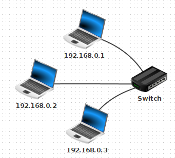

Testons le ```ping``` de la machine ```192.168.0.1```  vers la machine ```192.168.0.3```.

::: {.callout-tip collapse=true}
## Résultat du ping

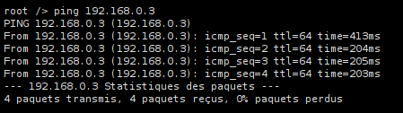
:::


### 1.1. La carte réseau et son adresse MAC

Chaque ordinateur sur le réseau dispose d'une adresse MAC (Media Access Control), qui est une valeur **unique** attribuée à sa carte réseau (Ethernet, Wifi, 4G, 5G, ...) **lors de sa fabrication en usine**.

Cette adresse est codée sur 48 bits, présentés sous la forme de 6 octets en hexadécimal. Exemple : ```fc:aa:14:75:45:a5```

Les trois premiers octets correspondent au code du fabricant.

Un site comme [https://www.macvendorlookup.com/](https://www.macvendorlookup.com/){target="_blank"} vous permet de retrouver le fabricant d'une adresse MAC quelconque.

### 1.2. Switch, hub, quelle différence ?

- Au sein d'un **hub Ethernet** (de moins en moins vendus), il n'y a **aucune analyse** des données qui transitent : il s'agit simplement d'un dédoublement des fils de cuivre (tout comme une multiprise électrique). L'intégralité des messages est donc envoyée à l'intégralité des ordinateurs du réseau, même s'ils ne sont pas concernés.

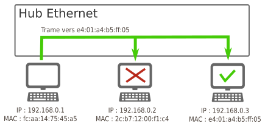

- Au sein d'un **switch Ethernet**, une analyse est effectuée sur la trame qui est à distribuer. Lors d'un branchement d'un nouvel ordinateur sur le switch, celui-ci récupère son adresse MAC, ce qui lui permet de **trier** les messages et de ne les distribuer qu'au bon destinataire.

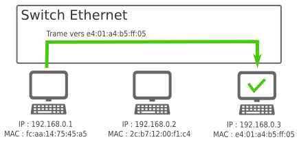

::: {.callout-note}
## Activité débranchée : simuler un switch

Par groupes de 3 — une personne joue le rôle du switch, deux autres sont les machines A et B.

Ici, **SAT** signifie **Source Address Table** : c'est la table d'association entre un **port** du switch et une **adresse MAC** observée sur ce port.

1. A envoie un message à B (écrit sur papier). Le switch ne connaît encore personne : il retransmet à **tout le monde** et note l'adresse MAC de A sur le port 1.
2. B répond à A. Le switch note l'adresse MAC de B (port 2). Sa **table SAT** est désormais complète.
3. A envoie à nouveau un message à B. Le switch l'achemine cette fois **directement** vers B.

**Table SAT à construire au fur et à mesure :**

| Port | Adresse MAC |
|------|-------------|
| 1    |             |
| 2    |             |

**Question :** un troisième ordinateur C est branché sur le port 3 mais n'a encore rien envoyé. Le switch peut-il lui adresser directement un message ?
:::

### Simulateur interactif de switch

[Voir en pleine page](https://sitelf.fr/divers/simulateur_switch/index.html){target="_blank"}

<iframe src="https://sitelf.fr/divers/simulateur_switch/index.html" width="100%" height="800"></iframe>

## 2. Un deuxième sous-réseau

Rajoutons un deuxième sous-réseau de la manière suivante (penser à bien renommer les switchs).

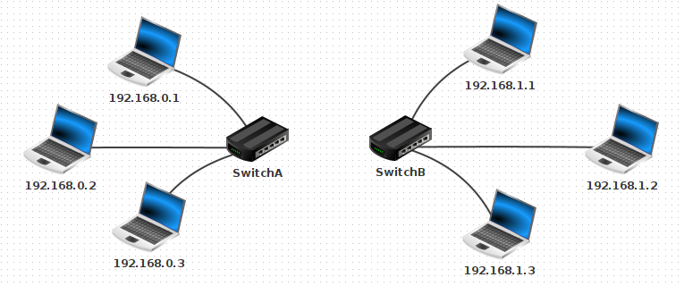

**Comment relier ces deux sous-réseaux ?**

Une réponse pas si bête : avec un câble entre les deux switchs !

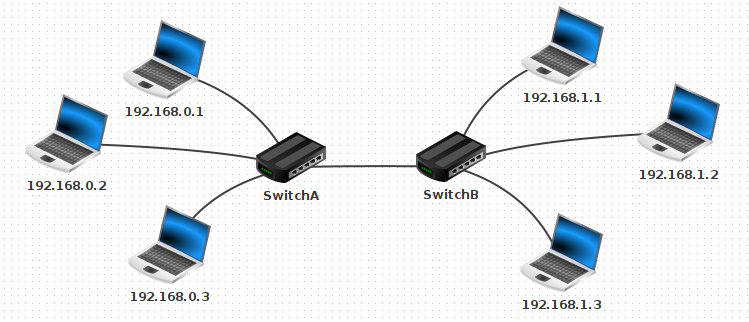

Testons cette hypothèse en essayant d'envoyer un ping à la machine ```192.168.1.2``` depuis la machine ```192.168.0.1```.

::: {.callout-tip collapse=true}
## Résultat du ping

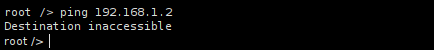

Cela ne marche pas. L'ordinateur **refuse** d'envoyer le ping vers la machine ```192.168.1.2```.

*(nous le verrons plus loin : car elle n'est pas dans son sous-réseau)*
:::

Temporairement, renommons la machine ```192.168.1.2``` en ```192.168.0.33```. Testons à nouveau le ping depuis la machine ```192.168.0.1```.

::: {.callout-tip collapse=true}
## Résultat du ping

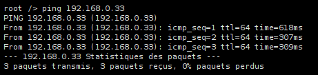

Cela marche. Les paquets sont bien acheminés.
:::

Dans la deuxième situation, les machines sont considérées comme faisant partie du même sous-réseau. Dans la première situation, elles sont considérées comme faisant partie de deux sous-réseaux différents. Mais comment est-ce déterminé ? C'est ce que nous allons voir dans la suite.

### 2.1. Notion de masque de sous-réseau

Dans Filius, lors de l'attribution de l'adresse IP à une machine, une ligne nous permet de spécifier le **masque de sous-réseau** (appelé simplement « Masque » dans Filius). C'est ce masque qui va permettre de déterminer si une machine appartient à un sous-réseau ou non, en fonction de son adresse IP.

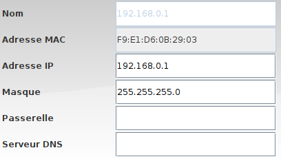

#### 2.1.1 Lecture intuitive

- Si le masque est ```255.255.255.0```, toutes les machines partageant les mêmes **trois** premiers nombres de leur adresse IP appartiendront au même sous-réseau. Comme ceci est le réglage par défaut de Filius, cela explique pourquoi  ```192.168.0.33``` et ```192.168.0.1``` sont sur le même sous-réseau, et pourquoi  ```192.168.1.2``` et ```192.168.0.1``` ne sont pas sur le même sous-réseau.

Dans cette configuration, 256 machines peuvent donc appartenir au même sous-réseau (ce n'est pas tout à fait le cas, car les adresses finissant par 0 ou par 255 sont réservées).

- Si le masque est ```255.255.0.0```, toutes les machines partageant les mêmes **deux** premiers nombres de leur adresse IP appartiendront au même sous-réseau.

Dans cette configuration, 65 536 machines peuvent être dans le même sous-réseau. (car 256^2=65536)

**Exercice**

- Renommons ```192.168.0.33``` en ```192.168.1.2``` et modifions son masque en ```255.255.0.0```.
- Modifions aussi le masque de ```192.168.0.1``` en ```255.255.0.0```.
- Testons le ping de ```192.168.0.1``` vers ```192.168.1.2```.

::: {.callout-tip collapse=true}
## Résultat du ping

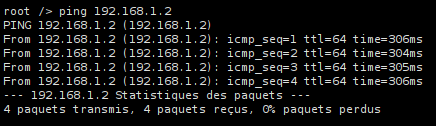

Cela marche. Les deux machines appartiennent maintenant au même sous-réseau.
:::

#### 2.1.2 L'opérateur ET bit à bit

Lorsqu'une machine A veut envoyer un message à une machine B, elle doit déterminer si cette machine :

- appartient au même sous-réseau : le message peut être envoyé directement via un ou plusieurs switchs.
- n'appartient pas au même sous-réseau : le message doit d'abord transiter par un routeur (voir 3.)

L'opération qui permet cette décision est le **ET bit à bit** (noté `&`) : pour deux octets, on compare les bits un à un suivant la règle `1 & 1 = 1`, et `0 & x = 0` dans tous les autres cas.

**Deux raccourcis utiles :** pour tout octet `x`, `x & 255 = x` (le masque `255` laisse tous les bits intacts) et `x & 0 = 0` (le masque `0` efface tout).

**Exemple sur un octet non trivial :** `129 & 248`

```
  129 = 10000001
  248 = 11111000
  &   = 10000000 = 128
```

Notant `IP_A`, `IP_B` les adresses des machines A et B, et `M` le masque de sous-réseau :

::: {.callout-important}
## Propriété

A et B appartiennent au même sous-réseau ⟺ `IP_A & M = IP_B & M`
:::

**Exemple d'application :** trois machines A, B, C configurées avec le masque `255.255.248.0` :

|        | machine A      | machine B       | machine C     |
|--------|----------------|-----------------|---------------|
| IP     | 192.168.129.10 | 192.168.135.200 | 192.168.145.1 |
| M      | 255.255.248.0  |  255.255.248.0  | 255.255.248.0 |
| IP & M | 192.168.128.0  |  192.168.128.0  | 192.168.144.0 |

Seul le 3ème octet est non trivial : `129 & 248 = 128`, `135 & 248 = 128`, `145 & 248 = 144`.

**Conclusion :** A et B sont dans le même sous-réseau ; C ne l'est pas.

::: {.callout-note}
## Exercice

Mêmes questions avec les machines suivantes, masque `255.255.252.0` :

|        | machine D      | machine E      | machine F    |
|--------|----------------|----------------|--------------|
| IP     | 172.16.12.5    | 172.16.14.200  | 172.16.16.1  |
| M      | 255.255.252.0  | 255.255.252.0  | 255.255.252.0|
| IP & M |                |                |              |

*Rappel :* `252 = 11111100₂`. Quelles machines sont dans le même sous-réseau ?
:::

#### 2.1.3 Vérification sur l'exemple initial

Avec un masque `255.255.255.0`, appliquer le ET bit à bit revient exactement à conserver les 3 premiers octets et forcer le dernier à 0. Les adresses `192.168.0.33` et `192.168.0.1` donnent toutes deux `192.168.0.0` : même sous-réseau. Les adresses `192.168.0.1` et `192.168.1.2` donnent `192.168.0.0` et `192.168.1.0` : sous-réseaux différents — ce qui confirme les observations de Filius du début.

### 2.2 Écriture des masques de sous-réseau : notation CIDR

D'après ce qui précède, 2 informations sont nécessaires pour déterminer le sous-réseau auquel appartient une machine : son IP et le masque de sous-réseau. 

Une convention de notation permet d'écrire simplement ces deux renseignements : **la notation CIDR**.

**Exemple** : Une machine d'IP ```192.168.0.33``` avec un masque de sous-réseau ```255.255.255.0``` sera désignée par ```192.168.0.33 / 24``` en notation CIDR.

Le suffixe ```/ 24``` signifie que le masque de sous-réseau commence par 24 bits consécutifs de valeur 1 : le reste des bits (donc 8 bits) est mis à 0.

Autrement dit, ce masque vaut ```11111111.11111111.11111111.00000000``` , soit ```255.255.255.0```.  

De la même manière, le suffixe ```/ 16``` donnera un masque de ```11111111.11111111.00000000.00000000``` , soit ```255.255.0.0```.  

Ou encore, un suffixe ```/ 21``` donnera un masque de ```11111111.11111111.11111000.00000000``` , soit ```255.255.248.0```. 

### 2.3 Adresses IP et masques : ce qu'il faut retenir

::: {.callout-important}
## Définition

- Les ordinateurs s'identifient sur les réseaux à l'aide d'une adresse IP (Internet Protocol). 
- Suivant la norme **IPv4**, les adresses IP sont encodées sur 4 octets : on parle d'**IPv4**.
- Chaque octet pouvant varier de la valeur (décimale) 0 à 255, cela signifie que les adresses IP théoriquement possibles vont de ```0.0.0.0``` à ```255.255.255.255```.
- Il y a donc $256^4=4 294 967 296$ adresses possibles.  On a longtemps cru que ce nombre serait suffisant. Ce n'est plus le cas, on est donc en train de passer sur des adresses à 6 octets (en hexadécimal) : voir la [norme IPv6](https://fr.wikipedia.org/wiki/Adresse_IPv6).
:::

**Exemple**

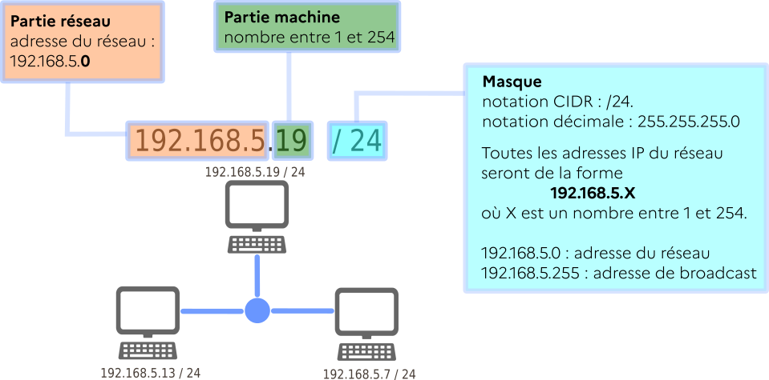
    

## 3. Un vrai réseau contenant deux sous-réseaux distincts : la nécessité d'un routeur

::: {.callout-note}
## Ce que vous avez déjà chez vous

La **box** de votre opérateur joue simultanément le rôle de **switch** (elle répartit la connexion entre tous les appareils du foyer : PC, smartphones, TV...) et de **routeur** (elle relie votre sous-réseau domestique à Internet). Sans elle, vos appareils pourraient se parler entre eux, mais ne pourraient pas accéder au Web. C'est exactement le problème que nous allons résoudre ici.
:::

Notre solution initiale (relier les deux switchs par un câble pour unifier les deux sous-réseaux) n'est pas viable à l'échelle d'un réseau planétaire.

Pour que les machines de deux réseaux différents puissent être connectées, on va utiliser un dispositif équipé de **deux cartes réseaux**, situé à cheval entre les deux sous-réseaux. Cet équipement de réseau est appelé **routeur** ou **passerelle**.

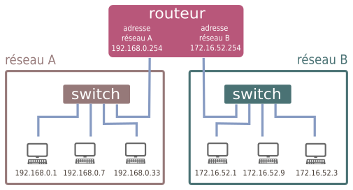

### 3.1 Principe de fonctionnement
Imaginons que la machine ```192.168.0.1 / 24``` veuille communiquer avec la machine  ```172.16.52.3 / 24```.  

L'observation du masque de sous-réseau de la machine ```192.168.0.1 / 24``` nous apprend qu'elle ne peut communiquer qu'avec les adresses de la forme ```192.168.0.X / 24```, où ```X``` est un nombre entre 0 et 255. 

Les 3 étapes du **routage** :

- Lorsque qu'une machine A veut envoyer un message à une machine B, elle va tout d'abord vérifier si cette machine appartient à son réseau local. Si c'est le cas, le message est envoyé par l'intermédiaire du switch qui relie les deux machines.
- Si la machine B n'est pas trouvée sur le réseau local de la machine A, le message va être acheminé vers le routeur, par l'intermédiaire de son adresse de passerelle (qui est bien une adresse appartenant au sous-réseau de A).
- De là, le routeur va regarder si la machine B appartient au deuxième sous-réseau auquel il est connecté. Si c'est le cas, le message est distribué, sinon, le routeur va donner le message à un autre routeur auquel il est connecté et va le charger de distribuer ce message : c'est le procédé (complexe) de routage qui sera abordé en classe de Terminale.

Dans notre exemple, l'adresse ```172.16.52.3``` n'est pas dans le sous-réseau de ```192.168.0.1```. Le message va donc transiter par le routeur.  

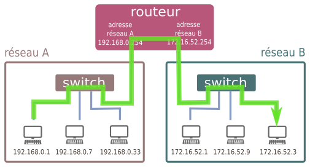 

### 3.2 Illustration avec Filius

- Rajoutons un routeur entre le SwitchA et le SwitchB.
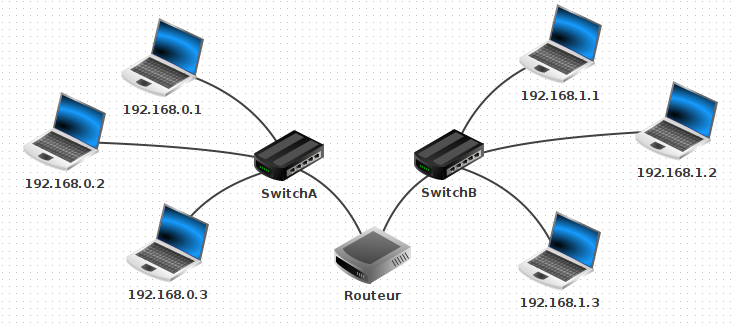

- Configuration du routeur :

     - L'interface reliée au Switch A doit avoir une adresse du sous-réseau A. On donne souvent une adresse finissant par ```254```, qui est en quelque sorte la dernière adresse du réseau (en effet l'adresse en ```255``` est appelée adresse de **broadcast**, utilisée pour envoyer un ping en une seule fois à l'intégralité d'un sous-réseau).  
     - On donne donc l'adresse ```192.168.0.254``` pour l'interface reliée au Switch A, et ```192.168.1.254``` pour l'interface reliée au Switch B. 

     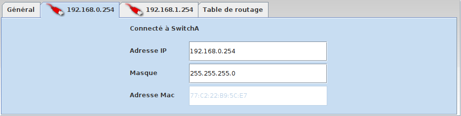

     - Dans l'onglet général, sélectionner « Routage automatique ».

     - Ainsi configuré notre routeur peut jouer le rôle de **passerelle** entre les deux sous-réseaux.

::: {.callout-tip collapse=true}
## Résultat du ping


Cela ne marche pas. La carte réseau refuse d'envoyer les paquets, car elle ne sait pas où les envoyer.
:::

Pourquoi cet échec ? Parce que nous devons dire à chaque machine qu'une passerelle est maintenant disponible pour pouvoir sortir de son propre sous-réseau. Il faut donc aller sur la machine ```192.168.0.1``` et lui donner l'adresse de sa passerelle, qui est ```192.168.0.254```.

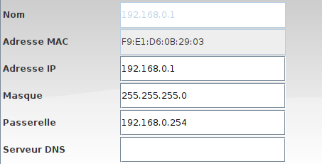

Attention, il faut faire de même pour ```192.168.1.2``` (avec la bonne passerelle...)  
Testons à nouveau le ping... Cette fois cela marche.

Plus intéressant : effectuons un ```traceroute``` entre  ```192.168.0.1``` et ```192.168.1.2```.

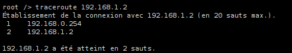

On constate que la machine ```192.168.1.2``` est atteignable en **deux sauts** depuis ```192.168.0.1```. Chaque **saut** correspond au passage par un routeur — ici un seul (```192.168.0.254```) est traversé. À chaque saut, le routeur décrémente le **TTL** (_Time To Live_) du paquet ; si cette valeur atteint 0, le paquet est détruit, ce qui évite à des paquets perdus de circuler indéfiniment sur le réseau.

**Cas d'un réseau domestique**  

Chez vous, la box de votre opérateur joue simultanément le rôle de switch et de routeur :

- switch, car elle répartit la connexion entre les différents dispositifs (ordinateurs branchés en ethernet, smartphone en wifi, tv connectée...)
- routeur, car elle fait le lien entre ce sous-réseau domestique (les appareils de votre maison) et le réseau internet.

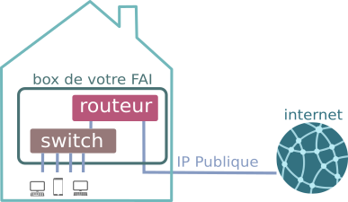

L'image ci-dessous présente le résultat de la commande ```ipconfig``` sous Windows. On y retrouve l'adresse IP locale ```192.168.9.103```, le masque de sous-réseau ```255.255.255.0``` et l'adresse de la passerelle ```192.168.9.1```.  
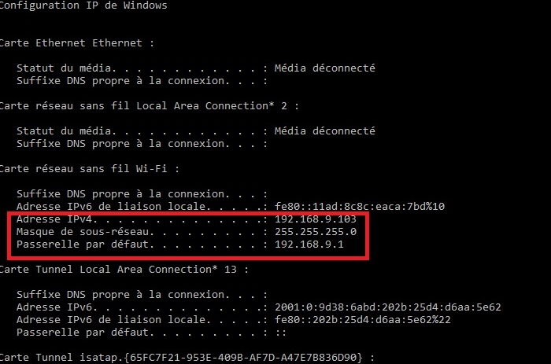
