## 1. Modèles en couches et encapsulation

Lorsqu'un message est envoyé d'un ordinateur à un autre, des informations sont **ajoutées successivement** à ce message à chaque étape, pour permettre son acheminement vers le bon réseau, le bon ordinateur, puis le bon logiciel. Ce mécanisme s'appelle l'**encapsulation**.

Les protocoles qui interviennent à chaque étape sont organisés en **couches**. Le modèle de référence pratique est le **modèle Internet** (ou modèle **TCP/IP**, 1974), organisé en **4** couches : liaison, réseau, transport, application. Le **modèle OSI** (1984) en distingue **7**, avec une granularité plus fine — c'est le modèle théorique normalisé.

Ces deux modèles s'articulent suivant la correspondance ci-dessous. Dans la suite du cours, nous utiliserons la numérotation OSI.

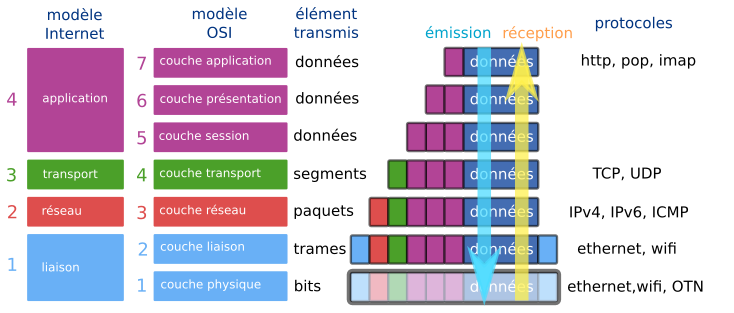

Lors de son émission, un message va subir successivement toutes les transformations effectuées par chaque couche, depuis sa création (couche 7) jusqu'à sa transmission physique (couche 1).  

Lorsque ce même message sera réceptionné, les transformations seront effectuées dans l'ordre inverse, jusqu'à la présentation du message au destinataire.

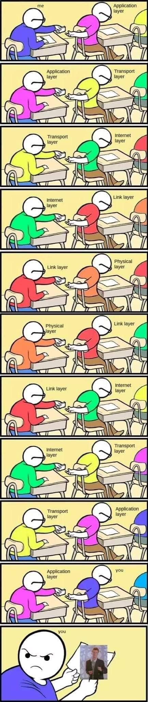


- **couches 7-6-5  — couches application-présentation-session :** 
Ces couches (réunies dans le modèle Internet en une couche unique «application» ) regroupent les protocoles nécessaires à la bonne mise en forme d'un message (au sens large) avant sa transmission. Ces protocoles peuvent être de nature très différente : protocole HTTP pour la transmisson de pages web, protocole FTP pour le transfert de fichiers, protocoles POP ou IMAP pour le courrier électronique...
</br>

- **couche 4 — couche transport :**   
Le protocole majeur de cette couche est le protocole TCP :
    - il s'assure par SYN-ACK que l'émetteur et le récepteur sont prêts à échanger des messages. 
    - il découpe en segments numérotés le message à transmettre (côté émetteur) ou bien recompose le message total en remettant les segments dans l'ordre (côté récepteur).    
Les éléments échangés avec la couche inférieure sont des **segments**.
</br>

- **couche 3 — couche réseau :**  
C'est la couche où chaque segment numéroté est encapsulé dans un paquet qui, suivant le protocole IP, va contenir son adresse source et son adresse de destination. C'est à ce niveau que se décide si le message doit rester dans le réseau local ou être envoyé sur un autre réseau via la passerelle du routeur.  
Les éléments échangés avec la couche inférieure sont des **paquets**.
</br>

- **couche 2 — couche liaison :**  
C'est l'encapsulation finale du message. Suivant le protocole Ethernet, les informations sont transmises d'une carte réseau à une autre, grâce à leur adresse MAC (Media Access Controler).  
Les éléments échangés avec la couche inférieure sont des **trames**.
</br>

- **couche 1 — couche physique :**  
C'est la couche où le message est transmis physiquement d'un point à un autre. Par signal lumineux (fibre optique), par ondes (wifi), par courant électrique (Ethernet)... Les éléments transmis sont les **bits**. 

::: {.callout-important}
## Résumé : pipeline d'encapsulation

À l'**émission**, chaque couche ajoute une en-tête au message reçu de la couche supérieure :

| Couche | Protocole | Action | Unité produite |
|--------|-----------|--------|----------------|
| Application | HTTP, FTP... | Crée le message | Données |
| Transport | TCP | Ajoute n° segment, ports | **Segment** |
| Réseau | IP | Ajoute adresses IP source/dest | **Paquet** |
| Liaison | Ethernet | Ajoute adresses MAC source/dest | **Trame** |
| Physique | — | Encode en signal | **Bits** |

À la **réception**, les couches sont traversées en sens inverse : chaque en-tête est lue puis retirée (**décapsulation**).
:::

 


Lors de son parcours, une trame peut être partiellement décapsulée et remonter à la couche 3, avant de redescendre et de continuer son chemin. C'est le cas notamment lors du passage dans un routeur. Mais jamais, lors de son acheminement, le contenu réel du message n'est ouvert : les paquets transmis sont acheminés de manière identique, qu'ils contiennent les éléments constitutifs d'une vidéo YouTube ou d'un email à votre cousin.  

## 2. Observation des trames avec Filius

### 2.1. Ping à travers un switch

::: {.callout-note}
## Problème préalable : pourquoi l'adresse IP ne suffit pas dans un sous-réseau ?

Le switch (couche 2) **ne lit pas les adresses IP** : il ne travaille qu'avec les adresses **MAC**. Pourtant, lorsqu'on lance un `ping` vers `192.168.0.11`, on connaît l'IP de destination — mais pas son adresse MAC.

**Question :** comment la machine émettrice va-t-elle obtenir l'adresse MAC de sa cible avant d'envoyer quoi que ce soit ?

C'est le problème que résout le protocole **ARP** (_Address Resolution Protocol_), que nous allons observer ci-dessous.
:::

- Relions une machine ```192.168.0.10``` d'adresse MAC ```BC:81:81:42:9C:31```  à une machine ```192.168.0.11``` d'adresse MAC ```2A:AB:AC:27:D6:A7``` à travers un switch.  
 
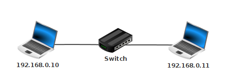 

- Observons la table SAT de notre switch : elle est vide, car aucune machine n'a encore cherché à communiquer.  

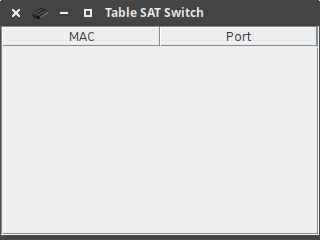 

- Lançons un ping depuis ```192.168.0.10``` vers ```192.168.0.11``` et observons les données échangées :   

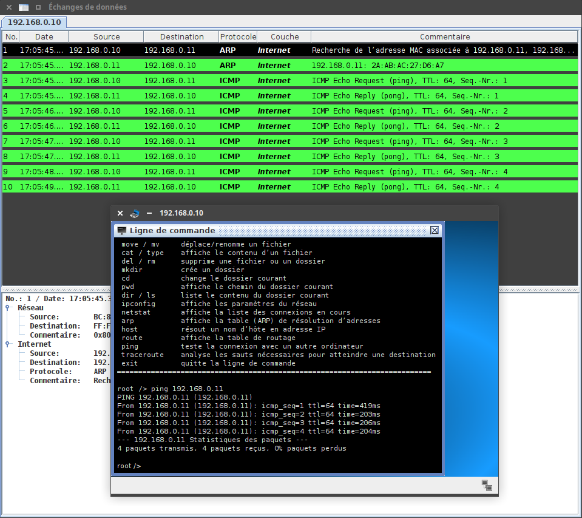  

- Observons de plus près la première ligne de données échangées.  

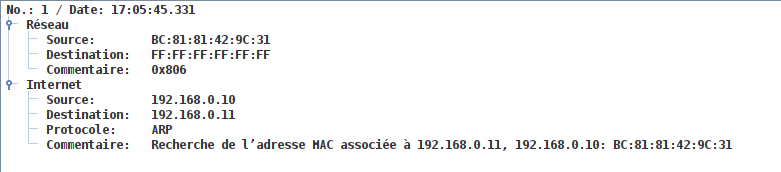   

Cette première ligne est une requête **ARP**. ARP est un protocole qui s'interface entre la couche 3 / réseau (appelée dans la capture d'écran _Internet_)  et la couche 2 / liaison (appelée dans la capture d'écran _Réseau_). Comme indiqué dans le commentaire, elle consiste à un appel à tout le réseau : "Est-ce que quelqu'un ici possède l'IP ```192.168.0.11``` ?

**Message 1 : « Qui possède l'IP ```192.168.0.11``` ? »**

Il faut comprendre à cette étape que l'adresse IP est totalement inutile pour répérer un ordinateur dans un sous-réseau. Ce sont les adresses MAC qui permettent de se repérer dans un sous-réseau. Les adresses IP, elles, permettront éventuellement d'acheminer le message jusqu'au bon sous-réseau (elles n'intéressent donc que les routeurs).


Revenons à notre ping vers ```192.168.0.11```.

La commande ```arp -a``` effectuée dans un terminal de la machine ```192.168.0.10``` nous permet de voir qu'elle ne connaît encore personne dans son sous-réseau. La table de correspondance IP ⮀ MAC ne contient que l'adresse de broadcast ```255.255.255.255```, qui permet d'envoyer un message à tout le réseau.  
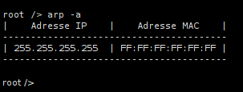 

Constatant qu'elle ne sait pas quelle est l'adresse MAC de ```192.168.0.11```, la machine ```192.168.0.10``` commence donc par envoyer un message à **tout** le sous-réseau, par l'adresse MAC de broadcast ```FF:FF:FF:FF:FF:FF```. Le switch va lui aussi relayer ce message à tous les équipements qui lui sont connectés (dans notre cas, un seul ordinateur).


**Message 2 : « Moi ! »**  

La machine ```192.168.0.11``` s'est reconnue dans le message de broadcast de la machine ```192.168.0.10```. Elle lui répond pour lui donner son adresse MAC.  

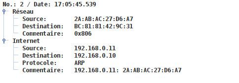 

À partir de ce moment, la machine ```192.168.0.10``` sait comment communiquer avec ```192.168.0.11```. Elle l'écrit dans sa table ```arp```, afin de ne plus avoir à émettre le message n°1 :  

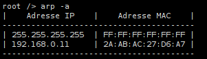 


Le switch, qui a vu passer sur ses ports 0 et 1 des messages venant des cartes MAC ```BC:81:81:42:9C:31```  et ```2A:AB:AC:27:D6:A7```, peut mettre à jour sa table SAT :  

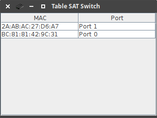 

Par la suite, il saura sur quel port rediriger les messages destinés à ces deux adresses MAC. Un switch est un équipement de réseau de la couche 2 du modèle OSI, il ne sait pas lire les adresses IP : il ne travaille qu'avec les adresses MAC.

**Message 3 : le ping est envoyé**

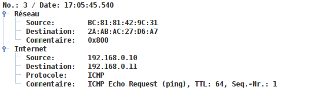 

Schématisons cette trame Ethernet (couche 2 du modèle OSI) :

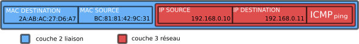 

**Message 4 : le pong est retourné**

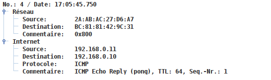 


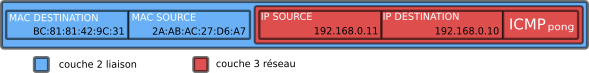 


### 2.2. Ping à travers un routeur

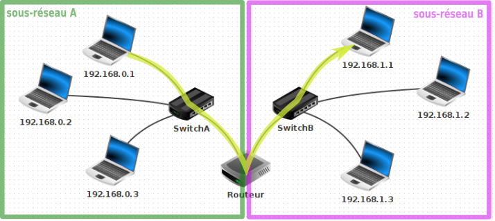 

L'objectif est d'observer les différentes trames lors d'un ping entre :

- la machine ```192.168.0.1 / 24``` (adresse MAC ```F9:E1:D6:0B:29:03``` ) et
- la machine ```192.168.1.1 / 24``` (adresse MAC ```D3:79:96:B8:5C:A4``` )

Le routeur est configuré ainsi :

- interface sur le réseau A :
    - IP : ```192.168.0.254``` 
    - MAC : ```77:C2:22:C9:5C:E7``` 
- interface sur le réseau B :
    - IP : ```192.168.1.254``` 
    - MAC : ```66:E5:4E:7D:0B:B0``` 


**Étape 0 : le routeur signale sa présence**

Lors de l'observation des messages reçus ou émis par la machine ```192.168.0.1```, on peut être intrigué par ce tout premier message reçu, émis par le routeur : 

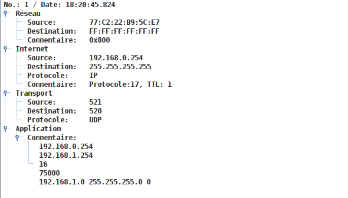 

On peut y distinguer les 4 couches du modèle Internet. Le routeur, par ce message distribué à tous les éléments du sous-réseau A (il envoie un message équivalent sur son sous-réseau B), déclare sa présence, et le fait qu'il possède deux interfaces, une pour chaque réseau. 
Il se positionne ainsi comme une passerelle : «c'est par moi qu'il faudra passer si vous voulez sortir de votre sous-réseau». 
Dans cette trame envoyée figure son adresse MAC, de sorte que tous les membres de son sous-réseau pourront donc communiquer avec lui.


**Étape 1 : de ```192.168.0.1``` vers le routeur**

La machine ```192.168.0.1 / 24``` calcule que la machine ```192.168.1.1 / 24``` avec laquelle elle veut communiquer n'est **pas** dans son sous-réseau.
Elle va donc envoyer son message à sa passerelle, qui est l'adresse du routeur dans son sous-réseau. 

Cette première trame est :

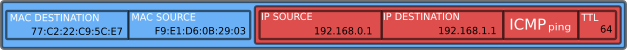 


**Étape 2 : le routeur décapsule la trame**

Le routeur est un équipement de réseau de couche 3 (couche réseau). Il doit observer le contenu du paquet IP (sans remonter jusqu'au contenu du message) pour savoir, suivant le procédé de **routage** (voir cours de Terminale), où acheminer ce paquet.

Dans notre cas, l'adresse IP ```192.168.1.1```de destination lui est accessible : elle fait partie de son sous-réseau B.

Le routeur va modifier la valeur du TTL (Time To Live), en la décrémentant de 1. Si, après de multiples routages, cette valeur devenait égale à 0, ce paquet serait détruit. Ceci a pour but d'éviter l'encombrement des réseaux avec des paquets ne trouvant pas leur destination.

Le routeur va ré-encapsuler le paquet IP modifié, et créer une nouvelle trame Ethernet en modifiant :

- l'adresse MAC source : il va mettre l'adresse MAC de son interface dans le sous-réseau B.
- l'adresse MAC de destination : il va mettre l'adresse MAC de ```192.168.1.1 ``` (qu'il aura peut-être récupérée au préalable par le protocole ARP)

Cette deuxième trame est donc :

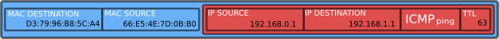 

On peut observer dans Filius cette trame, en se positionnant sur l'interface ```192.168.1.254 ``` du routeur, ou sur ```192.168.1.1 ``` :

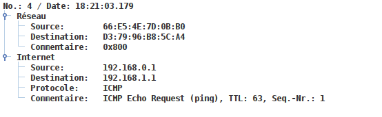 


En suivant le même principe, la machine ```192.168.1.1 ``` pourra envoyer son _pong_.

## 3. Protocole du bit alterné

Ce protocole est un exemple simple de fiabilisation du transfert de données. 

### 1. Contexte

- Alice veut envoyer à Bob un message M, qu'elle a prédécoupé en sous-messages M0, M1, M2,...
- Alice envoie ses sous-messages à une cadence Δt fixée.

### 2. Situation idéale

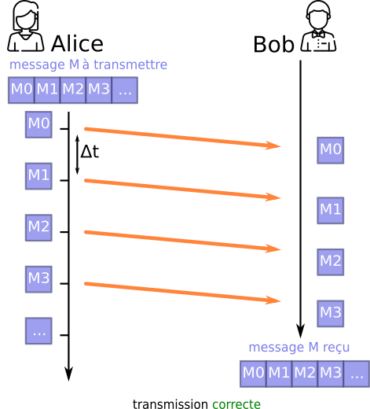 

Dans cette situation, les sous-messages arrivent tous à destination dans le bon ordre. La transmission est correcte.

### 3. Situation réelle
Mais parfois, les choses ne se passent pas toujours aussi bien. Car si on maîtrise parfaitement le timing de l'envoi des sous-messages d'Alice, on ne sait pas combien de temps vont mettre ces sous-messages pour arriver, ni même (attention je vais passer dans un tunnel) s'ils ne vont pas être détruits en route.

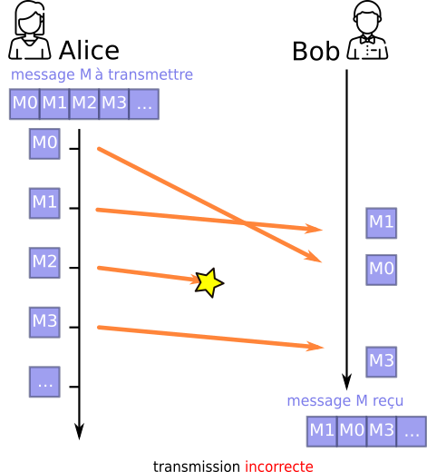 

Le sous-message M0 est arrivé après le M1, le message M2 n'est jamais arrivé...

Que faire ?

Écartons l'idée de numéroter les sous-messages, afin que Bob puisse remettre dans l'ordre les messages arrivés, ou même redemander spécifiquement des sous-messages perdus. C'est ce que réalise le protocole TCP (couche 4 — transport), c'est très efficace, mais cher en ressources. Essayons de trouver une solution plus basique.

### 3. Solution naïve...

Pourquoi ne pas demander à Bob d'envoyer un signal pour dire à Alice qu'il vient bien de recevoir son sous-message ?
Nous appelerons ce signal ACK (comme _acknowledgement_, traduisible par «accusé de réception»).
Ce signal ACK permettra à Alice de renvoyer un message qu'elle considérera comme perdu :

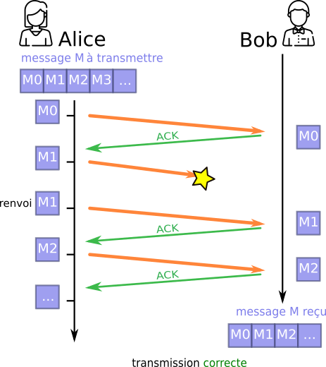 

N'ayant pas reçu le ACK consécutif à son message M1, Alice suppose (avec raison) que ce message n'est pas parvenu jusqu'à Bob, et donc renvoie le message M1.

### 4. Mais peu efficace...

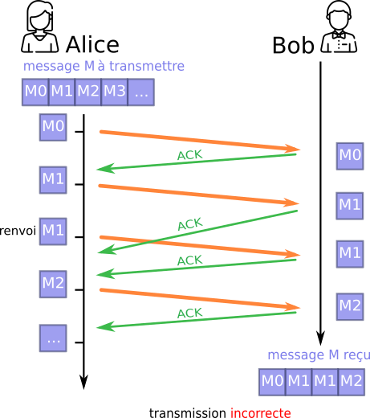 

Le deuxième ACK de Bob a mis trop de temps pour arriver (ou s'est perdu en route) et donc Alice a supposé que son sous-message M1 n'était pas arrivé. Elle l'a donc renvoyé, et Bob se retrouve avec deux fois le sous-message M1. La transmission est incorrecte. 
En faisant transiter un message entre Bob et Alice, nous multiplions par 2 la probabilité que des problèmes techniques de transmission interviennent. Et pour l'instant rien ne nous permet de les détecter.

### 5. Bob prend le contrôle

Bob va maintenant intégrer une méthode de validation du sous-message reçu. Il pourra décider de le garder ou de l'écarter. Le but est d'éviter les doublons.

Pour réaliser ceci, Alice va rajouter à chacun de ses sous-messages un bit de contrôle, que nous appelerons FLAG (drapeau). Au départ, ce FLAG vaut 0. 
Quand Bob reçoit un FLAG, il renvoie un ACK **égal au FLAG reçu**.

Alice va attendre ce ACK contenant le même bit que son dernier FLAG envoyé :

- tant qu'elle ne l'aura pas reçu, elle continuera à envoyer **le même sous-message, avec le même FLAG**.
- dès qu'elle l'a reçu, elle peut envoyer un nouveau sous-message en **inversant** («alternant») **le bit de son dernier FLAG** (d'où le nom de ce protocole).


Bob, de son côté, va contrôler la validité de ce qu'il reçoit : il ne gardera que **les sous-messages dont le FLAG est égal à l'inverse de son dernier ACK**. C'est cette méthode qui lui permettra d'écarter les doublons.

Observons ce protocole dans plusieurs cas :

##### 5.1 Cas où le sous-message est perdu

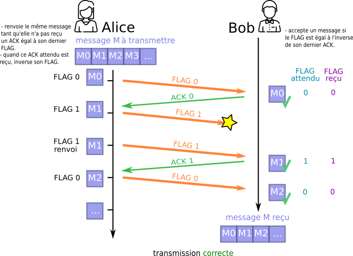 


##### 5.2 Cas où le ACK  est perdu
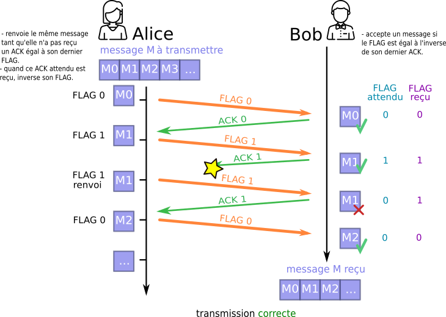 

Le protocole a bien détecté le doublon du sous-message M1.

##### 5.3 Cas où un sous-message est en retard

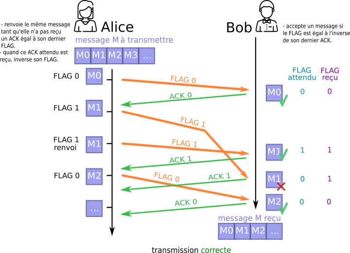 

Le protocole a bien détecté le doublon du sous-message M1. Cependant, si le retard du premier M1 était supérieur à la cadence d'envoi d'Alice, il pourrait être confondu avec le M1 d'une prochaine itération. C'est une **limite** de ce protocole : il suppose que les délais de transmission restent bornés.


### 6. Conclusion
Le protocole du bit alterné a longtemps été utilisé au sein de la couche 2 du modèle OSI (distribution des trames Ethernet). Simple et léger, il peut être mis en défaut lorsque les délais de transmission sont trop variables. C'est le protocole **TCP** (couche transport) qui le remplace dans les usages modernes : en **numérotant chaque segment**, il gère les pertes, les doublons et les retards de manière bien plus robuste — au prix d'une charge réseau plus importante.
