### Introduction

Le domaine de la robotique n'est pas nouveau, mais il est actuellement en pleine effervescence, avec des avancées technologiques majeures qui redéfinissent les interactions homme-machine (IHM). En 2026, la robotique se caractérise par une diversification rapide des applications, une intégration accrue de l'intelligence artificielle (IA) et une compétition géopolitique intense, notamment entre les États-Unis, la Chine et l'Europe.

# 1. Robotique humanoïde : locomotion dynamique et déploiement

## 1.1. Humanoïdes occidentaux

Les humanoïdes occidentaux savent aujourd'hui marcher de façon plus stable, garder leur équilibre quand la situation change et utiliser leurs deux mains dans des lieux complexes. La technologie progresse bien, mais elle reste surtout au stade de démonstration et n'est pas encore utilisée partout. Pour les interfaces homme-machine, cela demande des outils de téléopération simples, un bon retour d'effort et des écrans de suivi clairs. Les principales difficultés restent la sécurité près des personnes, le coût élevé d'intégration et le manque de normes communes entre les systèmes.

### Atlas de Boston Dynamics (filiale d’Hyundai) 

Atlas est un exemple emblématique de ces avancées, avec des capacités de locomotion et de manipulation impressionnantes, mais encore limitées à des environnements contrôlés.

Caractéristiques techniques :

* 56 degrés de liberté, joints à rotation complète 360°
* Portée de 2,3 m, charge utile certifiée 50 kg (110 lbs)
* Vision à 360° grâce aux caméras en tête
* Remplacement autonome de batteries pour une opération continue

Déploiements confirmés chez Hyundai (usine RMAC à Savannah, Géorgie) et Google DeepMind. Hyundai prévoit une usine capable de produire 30 000 Atlas par an à l’horizon 2028.

<button type="button" class="yt-lite-btn" aria-label="Lire la vidéo : Boston Dynamics Atlas - Next-Gen Humanoid Robot">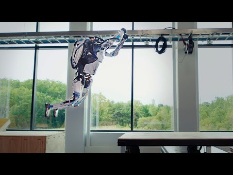Cliquer pour charger la vidéo depuis YouTube (youtube-nocookie.com)</button>

### Figure AI (filiale de Meta)

Figure AI a déployé son robot Figure 02 dans l’usine BMW de Spartanburg (Caroline du Sud), où il a contribué à l’assemblage de plus de 30 000 véhicules X3 sur 10 mois. BMW déploie désormais le nouveau Figure 03 dans son usine de Leipzig.

<button type="button" class="yt-lite-btn" aria-label="Lire la vidéo : Figure AI (filiale de Meta)">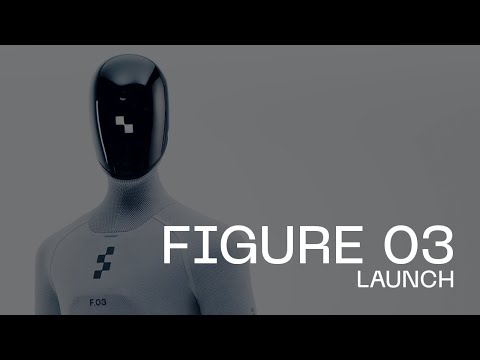Cliquer pour charger la vidéo depuis YouTube (youtube-nocookie.com)</button>

### Tesla Optimus

Tesla a présenté Optimus Gen 2, un humanoïde de 1,75 m pour la manipulation d’objets dans des environnements non structurés. Bien que les démonstrations soient impressionnantes, Tesla n’a pas encore annoncé de déploiement commercial concret. Plusieurs médias ont documenté des démos Optimus potentiellement téléopérées plutôt qu’entièrement autonome.

## 1.2. Humanoïdes chinois

<button type="button" class="yt-lite-btn" aria-label="Lire la vidéo : 1.2. Humanoïdes chinois">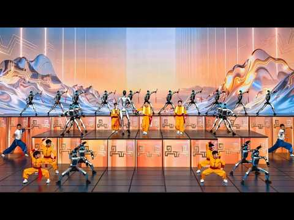Cliquer pour charger la vidéo depuis YouTube (youtube-nocookie.com)</button>

La Chine domine actuellement le monde de la robotique. De nombreux progrès sont obervés, comme une accélération forte sur l'agilité dynamique, la course longue distance et l'industrialisation à grande échelle. L'organisation industrielle du pays permet un passage rapide du prototype à des productions en série, avec des objectifs de production ambitieux. De plus, le rapport performance/prix des robots chinois est très agressif.

### Unitree G1/H1

Plateformes bipèdes réalisant des sauts, mouvements dynamiques et atteignant 15 km/h en course.

<button type="button" class="yt-lite-btn" aria-label="Lire la vidéo : Unitree G1/H1">Cliquer pour charger la vidéo depuis YouTube (youtube-nocookie.com)</button>

### Marathon humanoïde de Pékin (2025-2026)

Premier semi-marathon officiel réservé aux robots bipèdes (21,1 km). Le robot *Tien Kung Ultra* a remporté l'épreuve en 2h40, tandis que *Flash* (Honor) a établi un record de 50:26 en autonomie partielle.

<button type="button" class="yt-lite-btn" aria-label="Lire la vidéo : Marathon humanoïde de Pékin (2025-2026)">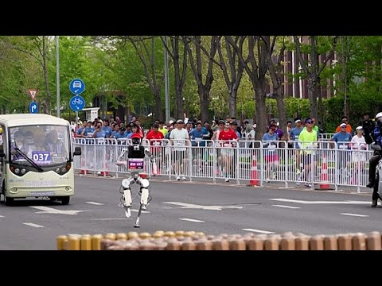Cliquer pour charger la vidéo depuis YouTube (youtube-nocookie.com)</button>

### AgiBot & Galbot

Architectures modulaires avec IA embarquée, visant une production de masse. **AgiBot** (Shanghai, fondée par un ancien talent « génie » de Huawei) a livré **5 000 humanoïdes en 2025** et produit son **10 000e robot en mars 2026**, avec une accélération : les 5 000 derniers ont été fabriqués en seulement 3 mois.

**Record Guinness, novembre 2025 :** L'AgiBot A2 a parcouru **106,286 km en 3 jours** (Suzhou → Bund de Shanghai), établissant le record mondial de la plus longue marche jamais effectuée par un robot humanoïde. Le robot n'a jamais été éteint grâce à un système de batteries chaudes remplaçables à la volée.

En avril 2026, AgiBot a déployé ses robots **G2** dans une usine d'électronique (Longcheer, Nanchang) : les robots assemblent des tablettes avec un taux de succès de **99 %** et une intégration en seulement **4 mois**.

<button type="button" class="yt-lite-btn" aria-label="Lire la vidéo : AgiBot &amp; Galbot">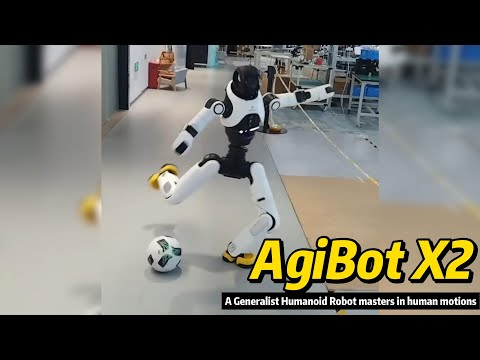Cliquer pour charger la vidéo depuis YouTube (youtube-nocookie.com)</button>

### UBTech Robotics — Première livraison en masse mondiale

**UBTech** (Shenzhen, cotée à Hong Kong depuis déc. 2023) a réalisé la **première livraison en masse mondiale de robots humanoïdes industriels** en novembre 2025 : des centaines de **Walker S2** livrés simultanément à BYD, Foxconn, Geely, FAW-Volkswagen et d'autres.

Caractéristique unique du **Walker S2** : il est le **premier humanoïde au monde à remplacer sa propre batterie de façon autonome en 3 minutes**, permettant un fonctionnement continu 24h/24 sans intervention humaine.

En janvier 2026, **Airbus** a commandé des Walker S2 pour ses sites de production aéronautique — signal fort de confiance d'un acteur occidental majeur.

<button type="button" class="yt-lite-btn" aria-label="Lire la vidéo : UBTech Robotics — Première livraison en masse mondiale">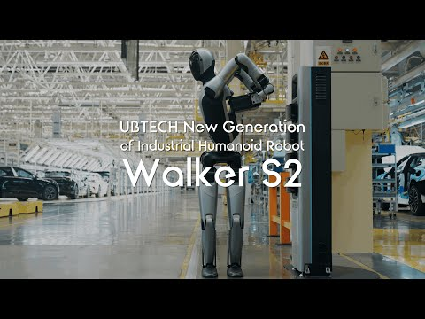Cliquer pour charger la vidéo depuis YouTube (youtube-nocookie.com)</button>

# 2. Robots quadrupèdes : agilité et applications industrielles

Les robots quadrupèdes ont atteint une agilité remarquable, avec des capacités de saut, de course et de franchissement d’obstacles. Ils sont de plus en plus utilisés dans des environnements industriels pour des tâches de surveillance, d’inspection et de logistique, notamment dans les zones difficiles d’accès ou dangereuses pour les humains.

### Boston Dynamics Spot — Inspection industrielle

Spot est le robot quadrupède de référence pour l’inspection industrielle (usines, chantiers, plateformes pétrolières). Sa commercialisation depuis 2020 en a fait la plateforme la plus déployée dans ce segment.

<button type="button" class="yt-lite-btn" aria-label="Lire la vidéo : Boston Dynamics Spot — Inspection industrielle">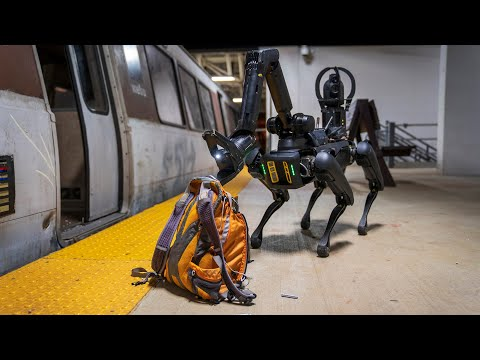Cliquer pour charger la vidéo depuis YouTube (youtube-nocookie.com)</button>

<button type="button" class="yt-lite-btn" aria-label="Lire la vidéo : Boston Dynamics Spot — Inspection industrielle">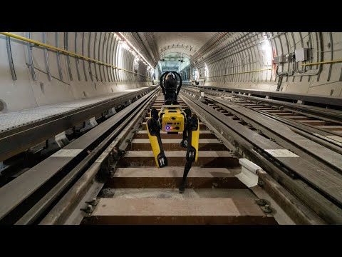Cliquer pour charger la vidéo depuis YouTube (youtube-nocookie.com)</button>

### Unitree

Unitree a développé une gamme de quadrupèdes (Go1, Go2, Go3) avec des capacités de saut et de course améliorées pour des applications industrielles et de recherche.

<button type="button" class="yt-lite-btn" aria-label="Lire la vidéo : Unitree">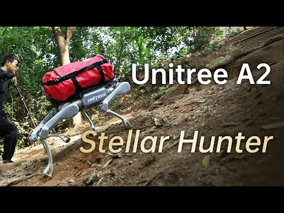Cliquer pour charger la vidéo depuis YouTube (youtube-nocookie.com)</button>

# 3. Cobotique et interaction physique sécurisée

Le terme *cobotique* désigne la collaboration homme-robot : interaction directe ou téléopérée entre homme et robot pour atteindre un objectif commun. Un cobot (ou robot collaboratif) est un type de robot conçu pour pouvoir être utilisé dans le même espace de travail que les opérateurs humains sans risque pour ces derniers, même sans barrière de protection physique, grâce à des capteurs et de programmes (intégrant éventuellement de l'intelligence artificielle) déclenchant un ralentissement du mouvement ou un arrêt complet si un risque de collision est détecté.

<button type="button" class="yt-lite-btn" aria-label="Lire la vidéo : 3. Cobotique et interaction physique sécurisée">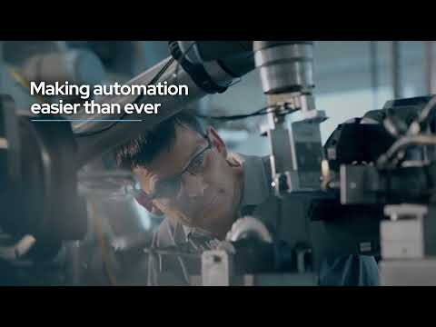Cliquer pour charger la vidéo depuis YouTube (youtube-nocookie.com)</button>

### Robotique médicale

Le système Da Vinci d’Intuitive Surgical est la référence mondiale de la chirurgie robotique téléopérée. Principe de fonctionnement :

* Le chirurgien pilote depuis une console ergonomique avec vue 3D haute définition
* Mouvements des mains traduits avec filtration des tremblements
* 4 bras articulés : 3 pour les instruments, 1 pour la caméra
* Incisions de la taille d’une pièce de monnaie

<button type="button" class="yt-lite-btn" aria-label="Lire la vidéo : Robotique médicale">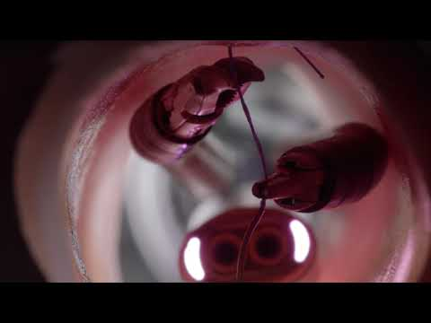Cliquer pour charger la vidéo depuis YouTube (youtube-nocookie.com)</button>

Une autre application médicale des robots collaboratifs est la rééducation assistée : des exosquelettes comme le **Lokomat** de Hocoma permettent une thérapie de marche intensive pour les patients atteints de lésions médullaires ou d’AVC, avec un feedback en temps réel pour ajuster les paramètres de mouvement.

<button type="button" class="yt-lite-btn" aria-label="Lire la vidéo : Robotique médicale">Cliquer pour charger la vidéo depuis YouTube (youtube-nocookie.com)</button>

# 4. Robots nageurs et plateformes aquatiques bio-inspirées

L'exploration sous-marine, la surveillance environnementale et les opérations de sauvetage motivent le développement de robots nageurs autonomes. Ceux-ci sont encore le plus souvent de prototypes de recherche. Deux approches dominent en 2025-2026 :

## 4.1. Bio-inspiration morphologique : serpents aquatiques et nage anguilliforme

Des chercheurs développent des robots serpents aquatiques stabilisés par contrôle morphologique et perception électrique, capables de nager en surface avec une fluidité inspirée des espèces naturelles.

<button type="button" class="yt-lite-btn" aria-label="Lire la vidéo : 4.1. Bio-inspiration morphologique : serpents aquatiques et nage anguilliforme">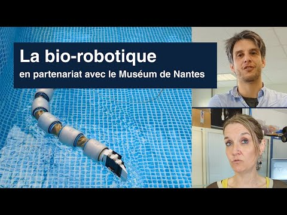Cliquer pour charger la vidéo depuis YouTube (youtube-nocookie.com)</button>

## 4.2. Soft robots sous-marins et principes biouniversels

Une approche émergente extrait des règles de conception transversales à plusieurs espèces (nageoires de manchots, corps fuselés, ventouses) pour créer des robots mous adaptables à différents milieux aquatiques. Des prototypes de préhension spiralée permettent une manipulation robuste sous courant.

<button type="button" class="yt-lite-btn" aria-label="Lire la vidéo : 4.2. Soft robots sous-marins et principes biouniversels">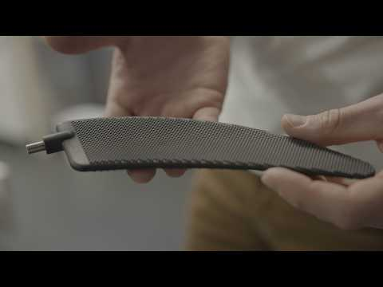Cliquer pour charger la vidéo depuis YouTube (youtube-nocookie.com)</button>

# 5. Robotique spatiale

### Perseverance — Exploration martienne autonome

Le rover Perseverance (NASA, en mission depuis février 2021) continue son exploration du cratère Jezero sur Mars. En 2025, il a collecté des échantillons présentant ce qui pourrait être des traces d’une vie passée.

<button type="button" class="yt-lite-btn" aria-label="Lire la vidéo : Perseverance — Exploration martienne autonome">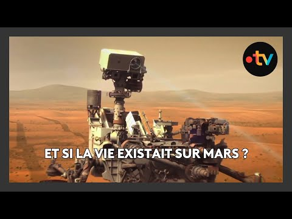Cliquer pour charger la vidéo depuis YouTube (youtube-nocookie.com)</button>

ExoMars / Rosalind Franklin — Mission ESA vers Mars

Le rover Rosalind Franklin (ESA/Thales Alenia Space) est prévu pour un lancement en octobre 2028 et un atterrissage le 30 novembre 2030 sur Oxia Planum.23

<button type="button" class="yt-lite-btn" aria-label="Lire la vidéo : Perseverance — Exploration martienne autonome">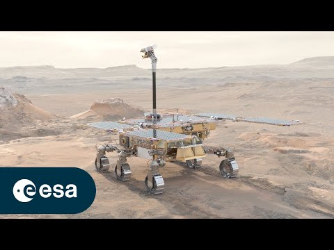Cliquer pour charger la vidéo depuis YouTube (youtube-nocookie.com)</button>

# 6. Autres robots

### General Robotics Lab

<button type="button" class="yt-lite-btn" aria-label="Lire la vidéo : General Robotics Lab">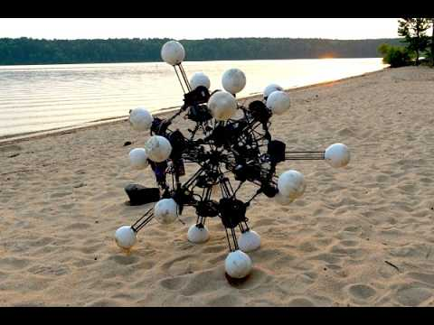Cliquer pour charger la vidéo depuis YouTube (youtube-nocookie.com)</button>

###  Spherical robot joins police patrols in China

<button type="button" class="yt-lite-btn" aria-label="Lire la vidéo : Spherical robot joins police patrols in China">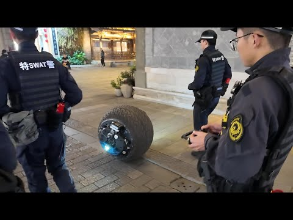Cliquer pour charger la vidéo depuis YouTube (youtube-nocookie.com)</button>

### Pour approfondir la réflexion...

<button type="button" class="yt-lite-btn" aria-label="Lire la vidéo : Pour approfondir la réflexion...">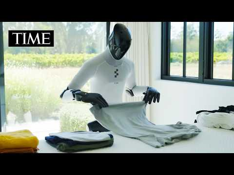Cliquer pour charger la vidéo depuis YouTube (youtube-nocookie.com)</button>

